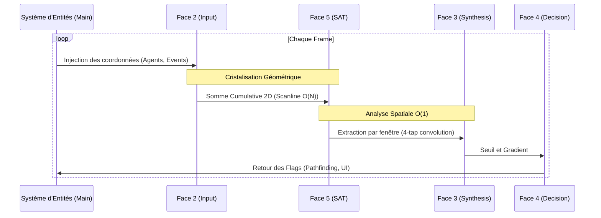

# L'Architecture Mathématique du Triade Engine

Le "Triade Engine" repose sur un concept fondamental : décomposer l'analyse d'un espace 2D complexe en **6 couches de mémoire contiguës**, appelées les "Faces" d'un cube virtuel. Plutôt que de calculer des interactions d'objet à objet (agents, bâtiments), le moteur calcule des équations de **champs scalaires** de cellule à cellule.

Chaque Face est un tableau natif à une dimension de taille $N = Largeur \times Hauteur$ (`Float32Array`). Le passage d'une face à l'autre est une opération mathématique stricte.

---

## 🎲 Face 1 : L'Originale (Le Monde Brut)
**Ce qu'elle représente :** Le "champ de fond". C'est l'univers tel qu'il existe avant toute analyse. Dans notre POC, c'était la densité de population absolue, projetée sur une grille.
**Principe Mathématique :**
Soit une fonction $M(x,y)$ représentant la valeur brute (ex: nombre d'habitants) aux coordonnées $(x,y)$.
$$Face1[x, y] = M(x,y)$$

**Exemple Visuel :**
|  |  |  |
| :---: | :---: | :---: |
| 10 | 12 | 10 |
| 11 | 15 | 11 |
| 10 | 12 | 10 |

---

## 👁️ Face 2 : Le Contexte (Le Phénomène Observé)
**Ce qu'elle représente :** Le signal spécifique que l'on souhaite étudier (ex: l'emplacement des écoles, ou l'odeur d'un prédateur). C'est une grille binaire ou pondérée injectée temporairement.
**Principe Mathématique :**
Soit une fonction $C(x,y)$ représentant l'intensité d'un phénomène précis.
$$Face2[x, y] = C(x,y)$$

**Exemple d'injection (un point d'intérêt à 1,1) :**
| Signal | 0 | 1 | 2 | 3 |
| :--- | :---: | :---: | :---: | :---: |
| **0** | 0 | 0 | 0 | 0 |
| **1** | 0 | **1** | 0 | 0 |
| **2** | 0 | 0 | 0 | 0 |
| **3** | 0 | 0 | 0 | 0 |

*(Note : Jusqu'ici, Face 1 et Face 2 ne sont que de simples données stoïques. La vraie magie commence à l'étape suivante).*

---

## ⚡ Face 5 : L'Intégrale (Le "Cheat Code" O1)
**Ce qu'elle représente :** La "Summed Area Table" (SAT). C'est le moteur de l'architecture. Elle contient **la somme cumulative** de toutes les valeurs de la Face 2 situées au nord-ouest d'un point donné. C'est l'opération qui permet de passer d'un temps de calcul $O(R^2)$ (quadratique) à un temps $O(1)$ (instantané), peu importe le rayon d'analyse futur.
**La Mécanique et Formule :**
Pour calculer la valeur d'une case sur la Face 5, on somme la case actuelle (Face 2), plus la case au-dessus (déjà calculée sur Face 5), plus la case à gauche (déjà calculée), moins la case en diagonale (car comptée deux fois).

$$Face5[x,y] = Face2[x,y] + Face5[x,y-1] + Face5[x-1,y] - Face5[x-1,y-1]$$

**Résultat de l'intégration (SAT) :**
| SAT | 0 | 1 | 2 | 3 |
| :--- | :---: | :---: | :---: | :---: |
| **0** | 0 | 0 | 0 | 0 |
| **1** | 0 | **1** | **1** | **1** |
| **2** | 0 | **1** | **1** | **1** |
| **3** | 0 | **1** | **1** | **1** |

Cette opération ne nécessite **qu'un seul passage de l'écran** ($O(N)$). Une fois la Face 5 générée, l'intelligence spatiale est "cristallisée" dans la géométrie.

---

## 🧠 Face 3 : La Synthèse (L'Agrégation Mathématique)
**Ce qu'elle représente :** C'est le résultat flouté, la fameuse "Heatmap" ou Onde d'influence. C'est la réponse à la question : *"Combien y a-t-il d'écoles autour de moi dans un rayon de 100 mètres ?"*
**Principe Mathématique :**
Grâce à la Face 5, on n'a plus besoin d'analyser tous les pixels dans un cercle. Pour connaître la somme *S* de n'importe quelle boîte rectangulaire de rayon $R$ autour du point $(x,y)$, on interroge uniquement les 4 coins de cette boîte sur la Face 5.

Formule de convolution en 4 additions/soustractions temporelles constantes $O(1)$ :
$$Somme = Face5[x+R, y+R] - Face5[x-R-1, y+R] - Face5[x+R, y-R-1] + Face5[x-R-1, y-R-1]$$

Ensuite, on applique un **Poids** (Weight) pour pondérer l'importance de cette "Odeur" :
$$Face3[x,y] = Somme \times Poids$$

**Propagation du signal (Heatmap) :**
| Result | 0 | 1 | 2 | 3 |
| :--- | :---: | :---: | :---: | :---: |
| **0** | 0.2 | 0.5 | 0.5 | 0.2 |
| **1** | 0.5 | **1.0** | 0.8 | 0.5 |
| **2** | 0.2 | 0.5 | 0.5 | 0.2 |
| **3** | 0.1 | 0.2 | 0.2 | 0.1 |

---

## 🚩 Face 4 : Le Décisionnaire (Flags & Extraction)
**Ce qu'elle représente :** C'est la couche d'alarme. Elle transforme la Face 3 (continue et nuancée) en décisions binaires ou zonales (ex : La "Loupe Stratégique" Cyan).
**Principe Mathématique :**
Application d'une fonction de transfert de seuil (Thresholding) :
$$Face4[x,y] = \begin{cases} 1 & \text{si } Face3[x,y] \ge Seuil \\ 0 & \text{sinon} \end{cases}$$

**Exemple de masque (Seuil à 0.5) :**
| Mask | 0 | 1 | 2 | 3 |
| :--- | :---: | :---: | :---: | :---: |
| **0** | 0 | 1 | 1 | 0 |
| **1** | 1 | **1** | 1 | 1 |
| **2** | 0 | 1 | 1 | 0 |
| **3** | 0 | 0 | 0 | 0 |

Dans des scénarios de Pathfinding (Wavefront Algorithm), la Face 4 peut stocker l'information booléenne : "Est-ce qu'une case contient un mur ou un obstacle infranchissable ?".

---

## 🔄 Face 6 : La Couche Complémentaire (Le Récipient d'Effet)
**Ce qu'elle représente :** C'est le "brouillon mémoire" de la génération précédente. Dans une simple analyse d'urbanisme statique, elle n'est pas utilisée.
Dans les **systèmes dynamiques récursifs** (comme le Game of Life, la réaction-diffusion chimique de Turing, ou l'écoulement des flux de Navier-Stokes), vous devez comparer l'état à l'instant T par rapport à l'état à l'instant T-1.
**Principe Mathématique :**
La Face 6 stocke la dérivée temporelle, ou simplement le gradient matriciel de la boucle précédente.
Un exemple dans le calcul d'une onde (Flow Field) :
$$Gradient_X = Face3[x+1, y] - Face3[x-1, y]$$

**Exemple de gradient (dérivation spatiale) :**
| Face 6 | 0 | 1 | 2 | 3 |
| :--- | :---: | :---: | :---: | :---: |
| **0** | 0.3 | 0 | -0.3 | 0 |
| **1** | 0.5 | 0 | -0.5 | 0 |
| **2** | 0.3 | 0 | -0.3 | 0 |

$$Face6(GradientX) = ...$$

---

Le "Cube Triade" n'est rien d'autre qu'un **pipeline d'équations scalaires figé dans une topologie mémoire optimisée pour écraser les boucles algorithmiques classiques de Javascript**.

Ce diagramme illustre l'empilement vertical (Z-Stack) des 6 couches de mémoire et le flux de données cyclique qui traverse ces "Faces".

```mermaid
graph TB
    classDef face1 fill:#e1f5fe,stroke:#01579b,stroke-width:2px;
    classDef face2 fill:#e8f5e9,stroke:#1b5e20,stroke-width:2px;
    classDef face5 fill:#fff3e0,stroke:#e65100,stroke-width:3px;
    classDef face3 fill:#fce4ec,stroke:#880e4f,stroke-width:2px;
    classDef face4 fill:#f3e5f5,stroke:#4a148c,stroke-width:2px;
    classDef face6 fill:#efebe9,stroke:#3e2723,stroke-width:2px;

    subgraph "Exploded Cube Architecture"
        F1[Face 1: Background Field]:::face1
        F2[Face 2: Input/Signal]:::face2
        F5[Face 5: Integrator - SAT]:::face5
        F3[Face 3: Heatmap/Odor]:::face3
        F4[Face 4: Threshold/Flags]:::face4
        F6[Face 6: Recursive/Diff]:::face6
        
        F1 -.-> F2
        F2 ==>|"O(N) Sum"| F5
        F5 ==>|"O(1) Extract"| F3
        F3 --> F4
        F3 --> F6
        F6 -.-> F2
        F4 --> Output[Decision/Render]
    end

    subgraph "Engine Loop Sequence"
        S1(1. Inject Entities) --> S2(2. Compute SAT)
        S2 --> S3(3. Spatial Filtering)
        S3 --> S4(4. Logic/Action)
        S4 -->|Next Frame| S1
    end
```

### Diagramme de Séquence de la Boucle

